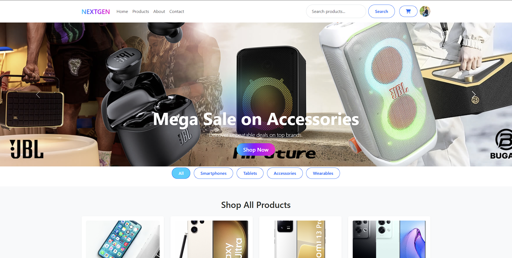

# 📱 NEXTGEN Mobile – E-Commerce Platform

## Project Overview
**NEXTGEN Mobile** is a full-featured e-commerce platform for mobile devices and accessories, designed and developed for the Sri Lankan market.  
The system provides a modern shopping experience for customers and a powerful administrative dashboard for managing products, users, orders, and analytics.

This project follows a **mobile-first, responsive design approach** and implements real-world e-commerce functionalities using web technologies.

---


### 🧑‍💻 Customer Features
- 🛍️ Browse products by category  
  *(Smartphones, Tablets, Accessories, Wearables)*
- 🔍 Advanced product search and filtering
- 🛒 Shopping cart management
- 💳 Multiple payment methods  
  *(Credit/Debit Card, PayPal, Bank Transfer, Cash on Delivery)*
- 👤 User profile management
- ⭐ Product reviews and ratings
- 💝 Wishlist functionality
- 📍 Store location with integrated map
- 🔐 Secure checkout process

---

### 🛠️ Admin Features
- 📊 Comprehensive admin dashboard with key metrics
- 📦 Order management system
- 👥 User management
- 🏷️ Product management *(Add, Edit, Delete)*
- 📈 Analytics and performance insights
- 🔍 Audit logs
- 👁️ Customer reviews monitoring
- ⚡ Quick actions panel
- 💚 System health monitoring

---

## 🛠️ Technology Stack

### Frontend
- HTML5  
- CSS3  
- Bootstrap 5  
- JavaScript  

### Backend
- PHP  
- MySQL  

### Design & UI
- Fully responsive design
- Mobile-first layout
- Modern gradient UI elements
- Interactive components

---

## 📸 Screenshots

### Admin Dashboard
*Complete overview of store performance with system health monitoring*  
>

### Product Management
*Manage inventory, pricing, and product details*  
> *(Add screenshot here)*

### Customer Interface
- Modern homepage with promotional banners  
  > *(Add screenshot here)*
- Product listing with advanced filters  
  > *(Add screenshot here)*
- Detailed product view with reviews and ratings  
  > *(Add screenshot here)*

### User Features
- Customer profile management  
  > *(Add screenshot here)*
- Secure checkout with multiple payment options  
  > *(Add screenshot here)*
- Contact form with integrated location map  
  > *(Add screenshot here)*

### Company Information
- Mission, vision, and values page  
  > *(Add screenshot here)*

---

## 🚀 Installation & Setup

1. Clone the repository
   ```bash
   git clone https://github.com/thishanherath/Nextgen-mobile.git
